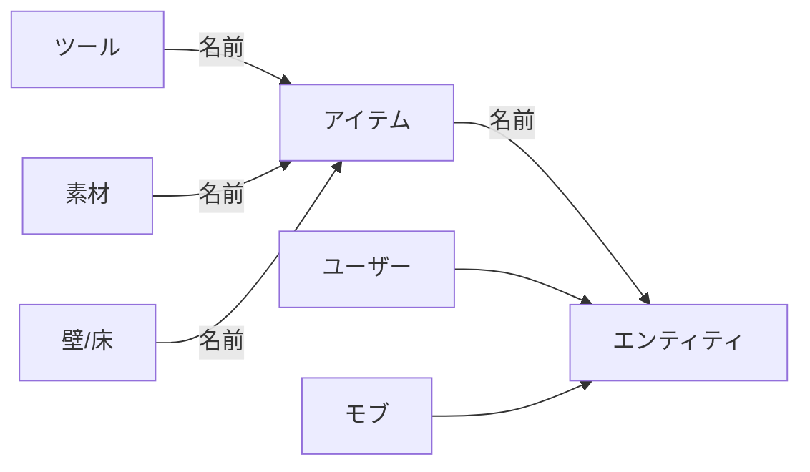

# BASER
二次元のわちゃわちゃするゲーム

## 開発用
BASERを作る上で何も考えずに作るとデータが散らばりすぎるのでデータ型を確実に定める

- 向きはradian / π
- 座標はタイルのサイズを1とする
- タイルはマップ上の四角の単位
- Floorが床に敷く系の構造物
- 基本は最低限の情報だけをサーバーで扱う
    - サイズとかの情報は名前と関連付けてクライアント側で行う

