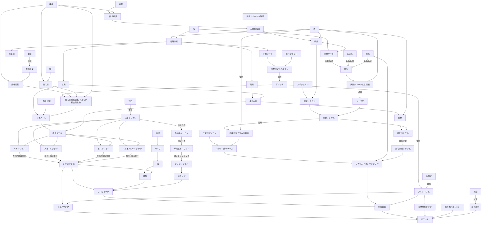

```mermaid
graph TD
	珪石--還元-->金属シリコン
  金属シリコン--精留反応-->多結晶シリコン

  塩素-->塩化水素
  水素-->塩化水素
  
  亜鉛--精留-->亜鉛蒸気
  酸素-->酸化亜鉛
  亜鉛蒸気-->酸化亜鉛

  酸素-->酸化銅
  銅-->酸化銅

  アルミナ-->酸化銅,酸化亜鉛,アルミナ複合酸化物
  酸化亜鉛-->酸化銅,酸化亜鉛,アルミナ複合酸化物
  酸化銅-->酸化銅,酸化亜鉛,アルミナ複合酸化物
  酸素-->酸化銅,酸化亜鉛,アルミナ複合酸化物

  水素-->メタノール
  一酸化炭素-->メタノール
  酸化銅,酸化亜鉛,アルミナ複合酸化物-->メタノール

  メタノール-->塩化メチル
  塩化水素-->塩化メチル

  金属シリコン-->メチルシラン
  塩化メチル-->メチルシラン
  金属シリコン-->フェニルシラン
  塩化メチル-->フェニルシラン
  金属シリコン-->ビニルシラン
  塩化メチル-->ビニルシラン
  金属シリコン-->フルオアルキルシラン
  塩化メチル-->フルオアルキルシラン

  メチルシラン--加水分解&重合-->シリコン樹脂
  フェニルシラン--加水分解&重合-->シリコン樹脂
  ビニルシラン--加水分解&重合-->シリコン樹脂
  フルオアルキルシラン--加水分解&重合-->シリコン樹脂

	多結晶シリコン--回転引き-->単結晶インゴット
	単結晶インゴット--薄くスライシング-->シリコンウェハ
	シリコンウェハ-->ICチップ

  水-->電解分離
  塩-->電解分離
  電解分離-->塩素
  電解分離-->食塩水
  電解分離-->水素
  電解分離-->苛性ソーダ

  苛性ソーダ-->水酸化アルミニウム
  ボーキサイト-->水酸化アルミニウム  

  水酸化アルミニウム--電解-->アルミナ
  アルミナ--電解-->アルミニウム
  氷晶石--電解-->アルミニウム

  木材-->パルプ
  パルプ-->紙

  紙-->基盤
  シリコン樹脂-->基盤

	シリコン樹脂-->コンピュータ
	基盤-->コンピュータ
	ICチップ-->コンピュータ

  炭酸リチウム--電解-->水酸化リチウム水溶液
  水--電解-->水酸化リチウム水溶液

  二酸化マンガン-->マンガン酸リチウム
  水酸化リチウム水溶液-->マンガン酸リチウム

  硫黄-->二酸化硫黄
  酸素-->二酸化硫黄
  
  二酸化硫黄-->三酸化硫黄
  酸化バナジウム触媒-->三酸化硫黄
  
  三酸化硫黄-->硫酸
  水-->硫酸

  スポジュメン-->硫酸リチウム
  硫酸-->硫酸リチウム

  塩-->硫酸ソーダ
  硫酸-->硫酸ソーダ

  硫酸ソーダ--灼熱融解-->黒灰
  石灰石--灼熱融解-->黒灰
  炭素--灼熱融解-->黒灰

  黒灰-->炭酸ナトリウム水溶液
  水-->炭酸ナトリウム水溶液

  炭酸ナトリウム水溶液--濃縮-->ソーダ灰

  硫酸リチウム-->炭酸リチウム
  ソーダ灰-->炭酸リチウム

  塩化水素-->塩酸
  水-->塩酸

  塩酸-->塩化リチウム
  炭酸リチウム-->塩化リチウム

  塩化リチウム--電気分解-->過塩素酸リチウム

  マンガン酸リチウム-->リチウムイオンバッテリー
  炭素-->リチウムイオンバッテリー
  過塩素酸リチウム-->リチウムイオンバッテリー

	シリコン樹脂-->フェアリング
	アルミニウム-->フェアリング

	コンピュータ-->制御装置
	リチウムイオンバッテリー-->制御装置
	アルミニウム-->制御装置

	アルミニウム-->液体燃料タンク

	原油--分留-->RP-1(液体燃料)

	フェアリング-->ロケット
	制御装置-->ロケット
	液体燃料タンク-->ロケット
	液体燃料エンジン-->ロケット
	RP-1-->ロケット
```